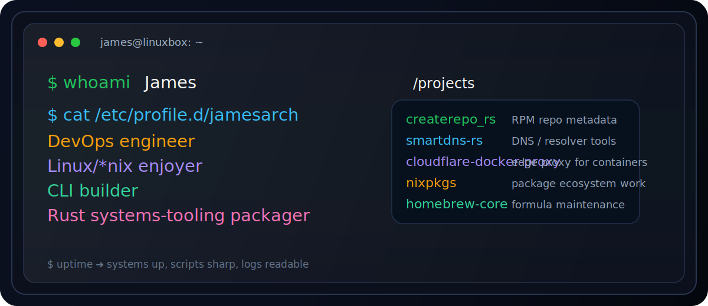

<div align="center">



</div>

---

# jamesarch

```bash
$ whoami
James

$ cat /etc/profile.d/jamesarch
DevOps engineer
Linux/*nix enjoyer
CLI builder
Rust systems-tooling packager
```

> small tools
> clear failures
> terminal first

## /about

I build boring, reliable infrastructure and sharp CLI tooling.

- CI/CD, packaging, release pipelines, reproducible builds
- Debian / RPM / Linux ecosystem work
- Rust for ops, static binaries, reproducible builds
- shell-native workflows over dashboard-heavy glue

## /tools

```text
linux    rust    go    python    docker    git
ci/cd    rpm     deb    nix       homebrew  opentofu
vim      neovim  emacs  shell     terminals
```

## /work

```text
$ git clone https://github.com/jamesarch/createrepo_rs
$ cd createrepo_rs
$ cargo run -- /path/to/rpms
```

### public repos worth a look

- [`createrepo_rs`](https://github.com/jamesarch/createrepo_rs) — Rust RPM repository metadata generator
- [`smartdns-rs`](https://github.com/jamesarch/smartdns-rs) — Rust DNS utility for resolver workflows
- [`cloudflare-docker-proxy`](https://github.com/jamesarch/cloudflare-docker-proxy) — container registry proxy on the edge
- [`jamesarch.github.io`](https://github.com/jamesarch/jamesarch.github.io) — personal website / landing page

### ecosystem trails

- `nixpkgs`
- `homebrew-core`
- `coreutils`
- `actix-web_examples`

## /style

```text
prefer boring reliability over clever fragility
prefer static binaries over dependency piles
prefer observable failures over silent magic
prefer terminal workflows over dashboards
```

## /status

No third-party stats widgets.
No broken embeds.
No private repos.

---

<pre>
$ uptime
systems up, scripts sharp, logs readable
</pre>
